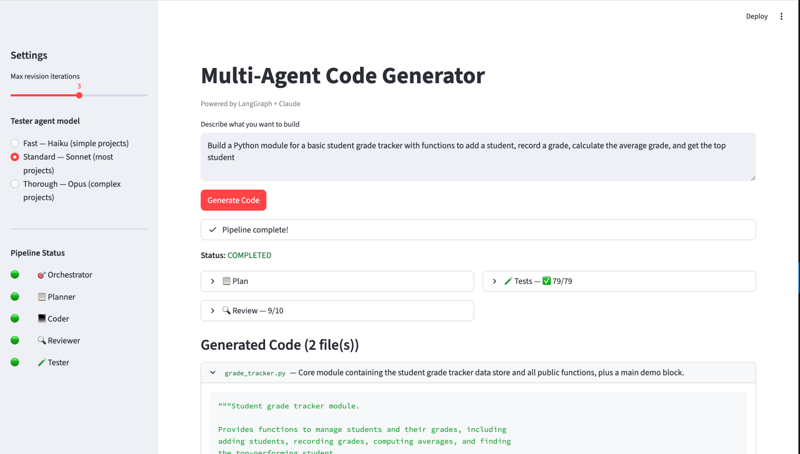

# Self-Evolving Code Generator

> V2 of [multi-agent-codegen](https://github.com/tathadn/multi-agent-codegen) — the same pipeline, now with a self-evolving tester.

A multi-agent AI code generation pipeline (LangGraph + Claude) where the **Tester agent autonomously improves its own test generation strategy** over successive generations through self-evaluation, failure analysis, and prompt evolution.

The five-agent pipeline (Orchestrator → Planner → Coder → Reviewer → Tester) is inherited from V1. V2 adds a **self-evolution engine** that wraps the Tester, observing its performance across batches of pipeline runs and iteratively rewriting its system prompt to produce better tests.

---

## Demo



*The sidebar shows real-time agent status indicators. A student grade tracker was generated, reviewed (9/10), and passed 79/79 tests on the first attempt.*

---

## Architecture

```
┌──────────────────────────────────────────────────────────────┐
│  CODE GENERATION PIPELINE (LangGraph StateGraph)             │
│                                                              │
│  Orchestrator → Planner → Coder → Reviewer → Tester ──┐     │
│                            ▲                           │     │
│                            └── revision loop ──────────┘     │
└──────────────────────────────────┬───────────────────────────┘
                                   │ test results + metadata
                                   ▼
┌──────────────────────────────────────────────────────────────┐
│  SELF-EVOLUTION ENGINE (evolution/)                           │
│                                                              │
│  Evaluator → Analyzer → Evolver → Tracker                    │
│      │                      │                                │
│      │ scores tests          │ writes new prompt              │
│      │ via LLM-as-Judge      │ (prompts/tester_gen_N.txt)     │
│      │                      │                                │
│      └──────────────────────┘                                │
│              ▲                                               │
│              │ next generation uses updated prompt            │
└──────────────────────────────────────────────────────────────┘
```

### Code Generation Pipeline

| Agent | Model | Role |
|---|---|---|
| **Orchestrator** | claude-opus-4-6 | Interprets the request, sets pipeline status |
| **Planner** | claude-sonnet-4-6 | Produces a structured plan: objective, steps, files, dependencies |
| **Coder** | claude-sonnet-4-6 | Generates `CodeArtifact` objects; on revisions, receives review issues and test failures as context |
| **Reviewer** | claude-sonnet-4-6 | Scores code 0–10, flags issues and suggestions |
| **Tester** | configurable | Generates pytest files for the given prompt generation, runs them in a Docker sandbox |

After the Tester runs, a `should_continue` router either ends the pipeline (`COMPLETED`) or loops back to the Coder if tests failed or the review score is below threshold.

### Self-Evolution Engine

| Component | Model | Role |
|---|---|---|
| **Evaluator** | Claude Haiku | LLM-as-Judge: scores each test for bug detection, false failure, redundancy, coverage category |
| **Analyzer** | Claude Sonnet | Identifies the top 3 specific, actionable failure patterns from metrics + raw results |
| **Evolver** | Claude Sonnet | Makes surgical edits to the tester prompt — preserving strengths, inserting fix instructions |
| **Tracker** | — | JSON persistence to `experiments/{name}/`; maintains running `evolution_history.json` |

#### Scoring Weights

```python
WEIGHTS = {
    "bug_detection_rate": 0.30,   # higher is better
    "false_failure_rate": 0.25,   # inverted: lower is better
    "coverage_quality":   0.20,   # 1-10 normalised to 0-1
    "edge_case_coverage": 0.15,   # 1-10 normalised to 0-1
    "redundancy_rate":    0.10,   # inverted: lower is better
}
```

#### Rollback Logic

If a newly evolved prompt causes the overall score to drop by more than 15% relative to the previous generation, the evolution loop automatically reverts to the prior generation's prompt and continues.

---

## Quick Start

```bash
# 1. Clone and install
git clone https://github.com/your-username/self-evolving-codegen.git
cd self-evolving-codegen
pip install -e ".[dev]"

# 2. Set your API key
cp .env.example .env
# open .env and set ANTHROPIC_API_KEY=sk-ant-...

# 3. Launch the Streamlit UI
streamlit run app.py

# 4. Run the evolution loop (separate terminal)
python run_evolution.py --generations 3 --batch-size 3   # quick test
python run_evolution.py                                   # full run (10 gens, 5 tasks)
python run_evolution.py --experiment my_run_001           # named experiment
```

---

## Using the Evolution Loop

### CLI Options

```
--generations N     Total evolution generations (default: 10)
--batch-size N      Coding tasks evaluated per generation (default: 5)
--experiment NAME   Experiment identifier used as the output directory name
```

### What it produces

For each generation, the tracker saves to `experiments/{name}/`:

```
experiments/my_run_001/
├── evolution_history.json   # running log of all GenerationMetrics
├── metrics_gen_0.json
├── metrics_gen_1.json
├── ...
├── prompt_gen_0.txt         # tester prompt used at gen 0
├── prompt_gen_1.txt         # evolved prompt for gen 1
├── ...
├── analysis_gen_0.json      # failure patterns + proposed fixes
└── evolution_chart.png      # 2×2 performance chart
```

### Evolution Dashboard

After running the loop, open the **Evolution Dashboard** tab in the Streamlit app to:

- Browse experiments by name
- View the performance chart
- Compare per-generation metrics in a table
- Diff tester prompts side-by-side
- Read per-generation strengths and weaknesses

---

## Sample Tasks

The evolution loop evaluates the tester across 10 coding tasks of varying complexity:

- Python calculator with division-by-zero handling
- FastAPI server with `/health` and `/echo` endpoints
- Linked list with insert, delete, search, reverse
- File-based todo list manager
- Password validator (length, case, digits, special chars)
- CSV parser with column statistics
- Token-bucket rate limiter
- LRU cache
- Markdown-to-HTML converter
- Binary search tree

Tasks are drawn cyclically if `--batch-size` exceeds 10.

---

## Key Design Decisions

**Evolution is a wrapper, not a core change.** The pipeline agents (`graph/workflow.py`) are untouched. `run_evolution.py` invokes the pipeline programmatically; evolution components never import from `graph/`. The Tester is the only agent parameterised by generation — `generation=0` produces identical behaviour to V1.

**Surgical prompt edits, not rewrites.** The Evolver is instructed to preserve the structure and wording that works, insert specific imperative directives, and keep the output under 1000 words to prevent prompt bloat.

**Specific failure patterns, not vague advice.** The Analyzer prompt enforces a strict rule: every identified pattern must be concrete and cite observable evidence (e.g. "misses division-by-zero in 70% of arithmetic tasks"), never generic (e.g. "should be more thorough").

**Cost-efficient judging.** The Evaluator uses Claude Haiku (the cheapest model) to score each test. Sonnet is reserved for the Analyzer and Evolver where reasoning quality matters more.

---

## Tech Stack

| Library | Version | Purpose |
|---|---|---|
| [LangGraph](https://github.com/langchain-ai/langgraph) | ≥ 0.2.0 | Agent orchestration with conditional edges |
| [LangChain Anthropic](https://github.com/langchain-ai/langchain) | ≥ 0.3.0 | Claude API via `ChatAnthropic` |
| [Pydantic](https://docs.pydantic.dev/) | ≥ 2.0.0 | Typed state schemas and structured LLM outputs |
| [Streamlit](https://streamlit.io/) | ≥ 1.40.0 | Web UI with real-time streaming |
| [Matplotlib](https://matplotlib.org/) | ≥ 3.8.0 | Evolution performance charts |
| [python-dotenv](https://github.com/theskumar/python-dotenv) | ≥ 1.0.0 | `.env` loading |
| Docker | — | Isolated sandbox for test execution |

Python ≥ 3.10 required.

---

## Environment Variables

```bash
# Required
ANTHROPIC_API_KEY=sk-ant-...

# Optional model overrides
TESTER_MODEL=claude-sonnet-4-6
EVALUATOR_MODEL=claude-haiku-4-5-20251001
ANALYZER_MODEL=claude-sonnet-4-6
EVOLVER_MODEL=claude-sonnet-4-6

# Optional: LangSmith tracing
LANGCHAIN_TRACING_V2=true
LANGCHAIN_API_KEY=your_langsmith_key
LANGCHAIN_PROJECT=self-evolving-codegen
```

---

## Project Structure

```
self-evolving-codegen/
├── agents/                    # Agent implementations
│   ├── orchestrator.py
│   ├── planner.py
│   ├── coder.py
│   ├── reviewer.py
│   └── tester.py              # Modified: supports generation param
├── evolution/                 # Self-evolution engine
│   ├── models.py              # TestEffectivenessScore, GenerationMetrics, EvolutionHistory
│   ├── evaluator.py           # LLM-as-Judge test scoring
│   ├── analyzer.py            # Failure pattern analysis
│   ├── evolver.py             # Prompt rewriter
│   ├── tracker.py             # JSON persistence
│   └── visualize.py           # Matplotlib performance charts
├── graph/
│   └── workflow.py            # LangGraph StateGraph (unchanged from V1)
├── models/
│   └── schemas.py             # AgentState, TestResult (with V2 optional fields)
├── prompts/
│   ├── tester_gen_0.txt       # Base tester prompt
│   └── tester_gen_N.txt       # Auto-generated evolved versions
├── sandbox/
│   └── Dockerfile             # Isolated test runner
├── experiments/               # Saved evolution run data (gitignored)
├── app.py                     # Streamlit UI with Evolution Dashboard tab
└── run_evolution.py           # Main evolution loop
```
